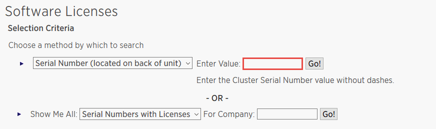

= 新增基於SnapCenter Standard 控制器的許可證
:allow-uri-read: 
:icons: font
:imagesdir: ../media/

[role="lead"]
如果您使用FAS、 AFF或ASA儲存控制器，則需要基於SnapCenter Standard 控制器的授權。

基於控制器的授權具有以下特點：

* 購買 Premium 或 Flash Bundle 即可獲得SnapCenter Standard 權利（不包含在基礎包中）
* 無限儲存使用
* 使用ONTAP系統管理器或ONTAP CLI 直接加入到FAS、 AFF或ASA儲存控制器。
+

NOTE: 您無需在SnapCenter使用者介面中輸入基於SnapCenter控制器的授權的任何授權資訊。

* 鎖定到控制器的序號

有關所需許可證的信息，請參閱link:../get-started/concept_snapcenter_licenses.html["SnapCenter許可證"]。

== 步驟 1：驗證是否安裝了SnapManager Suite 許可證

您可以使用SnapCenter使用者介面檢查FAS、 AFF或ASA主儲存系統上是否安裝了SnapManager Suite 許可證，並確定哪些系統需要許可證。SnapManager Suite 授權僅適用於主儲存系統上的FAS、 AFF和ASA SVM 或叢集。

NOTE: 如果您的控制器上已有SnapManager Suite 許可證， SnapCenter會自動提供基於標準控制器的授權授權。SnapManagerSuite 授權和基於SnapCenter Standard 控制器的授權這兩個名稱可以互換使用，但它們指的是同一個授權。

.步驟
. 在左側導覽窗格中，選擇*儲存系統*。
. 在「儲存系統」頁面中，從「類型」下拉式選單中選擇是否要查看已新增的所有 SVM 或叢集：
+
** 若要查看已新增的所有 SVM，請選擇 * ONTAP SVM*。
** 若要查看已新增的所有集群，請選擇「ONTAP集群」。
+
當您選擇叢集名稱時，叢集中的所有 SVM 都會顯示在 Storage Virtual Machines 部分。

. 在儲存連接清單中，找到控制器許可證列。
+
控制器許可證列顯示以下狀態：

+
** 表示SnapManager Suite 許可證已安裝在FAS、 AFF或ASA主儲存系統上。
** image:../media/controller_not_licensed_icon.gif["取消圖示"]表示FAS、 AFF或ASA主儲存系統上未安裝SnapManager Suite 授權。
** 不適用表示SnapManager Suite 授權不適用，因為儲存控制器位於Amazon FSx for NetApp ONTAP、 Cloud Volumes ONTAP、 ONTAP Select或輔助儲存平台。

== 第 2 步：識別控制器上安裝的許可證

您可以使用ONTAP命令列查看控制器上安裝的所有授權。您應該是FAS、 AFF或ASA系統上的叢集管理員。

NOTE: 控制器將基於SnapCenter Standard 控制器的授權顯示為 SnapManagerSuite 授權。

.步驟
. 使用ONTAP命令列登入NetApp控制器。
. 輸入 license show 命令，然後查看輸出以查看是否已安裝 SnapManagerSuite 授權。
+
.範例輸出
[%collapsible]
====
[listing]
----
cluster1::> license show
(system license show)

Serial Number: 1-80-0000xx
Owner: cluster1
Package           Type     Description              Expiration
----------------- -------- ---------------------    ---------------
Base              site     Cluster Base License     -

Serial Number: 1-81-000000000000000000000000xx
Owner: cluster1-01
Package           Type     Description              Expiration
----------------- -------- ---------------------    ---------------
NFS               license  NFS License              -
CIFS              license  CIFS License             -
iSCSI             license  iSCSI License            -
FCP               license  FCP License              -
SnapRestore       license  SnapRestore License      -
SnapMirror        license  SnapMirror License       -
FlexClone         license  FlexClone License        -
SnapVault         license  SnapVault License        -
SnapManagerSuite  license  SnapManagerSuite License -
----
====
+
在範例中，已安裝 SnapManagerSuite 許可證，因此不需要額外的SnapCenter許可操作。

== 步驟 3：檢索控制器序號

使用ONTAP命令列取得控制器序號。您必須是FAS、 AFF或ASA系統上的叢集管理員才能取得基於控制器的許可證序號。

.步驟
. 使用ONTAP命令列登入控制器。
. 輸入 system show -instance 命令，然後查看輸出以找到控制器序號。
+
.範例輸出
[%collapsible]
====
[listing]
----
cluster1::> system show -instance

Node: fasxxxx-xx-xx-xx
Owner:
Location: RTP 1.5
Model: FAS8080
Serial Number: 123451234511
Asset Tag: -
Uptime: 143 days 23:46
NVRAM System ID: xxxxxxxxx
System ID: xxxxxxxxxx
Vendor: NetApp
Health: true
Eligibility: true
Differentiated Services: false
All-Flash Optimized: false

Node: fas8080-41-42-02
Owner:
Location: RTP 1.5
Model: FAS8080
Serial Number: 123451234512
Asset Tag: -
Uptime: 144 days 00:08
NVRAM System ID: xxxxxxxxx
System ID: xxxxxxxxxx
Vendor: NetApp
Health: true
Eligibility: true
Differentiated Services: false
All-Flash Optimized: false
2 entries were displayed.
----
====
. 記錄序號。

== 步驟 4：檢索基於控制器的許可證的序號

如果您使用的是FAS、 ASA或AFF存儲，則可以先從NetApp支援站點擷取基於SnapCenter控制器的許可證，然後再使用ONTAP命令列進行安裝。

.開始之前
* 您應該擁有有效的NetApp支援網站登入憑證。
+
如果您沒有輸入有效的憑證，系統將不會傳回任何有關您搜尋的資訊。

* 您應該有控制器序號。

.步驟
. 登入 http://mysupport.netapp.com/["NetApp支援站點"^]。
. 導覽至*系統* > *軟體許可證*。
. 在選擇標準區域，確保選擇了序號（位於裝置背面），輸入控制器序號，然後選擇*Go!*。
+

+
顯示指定控制器的許可證清單。

. 找到並記錄SnapCenter Standard 或 SnapManagerSuite 許可證。

== 步驟 5：新增基於控制器的許可證

當您使用FAS、 AFF或ASA系統並且擁有SnapCenter Standard 或 SnapManagerSuite 授權時，您可以使用ONTAP命令列新增基於SnapCenter控制器的授權。

.開始之前
* 您應該是FAS、 AFF或ASA系統上的叢集管理員。
* 您應該擁有SnapCenter Standard 或 SnapManagerSuite 授權。

.關於此任務
如果您想使用FAS、 AFF或ASA儲存試用安裝SnapCenter ，您可以取得 Premium Bundle 評估授權以安裝在控制器上。

如果您想嘗試安裝SnapCenter ，您應該聯絡您的銷售代表以取得 Premium Bundle 評估授權以安裝在您的控制器上。

.步驟
. 使用ONTAP命令列登入NetApp叢集。
. 新增 SnapManagerSuite 許可證金鑰：
+
`system license add -license-code license_key`

+
此命令在管理員權限層級可用。

. 驗證是否已安裝 SnapManagerSuite 授權：
+
`license show`

== 步驟 6：刪除試用許可證

如果您正在使用基於控制器的SnapCenter標準許可證，並且需要刪除基於容量的試用許可證（序號以「50」結尾），則應使用 MySQL 命令手動刪除試用許可證。無法使用SnapCenter使用者介面刪除試用許可證。

NOTE: 只有當您使用基於SnapCenter Standard 控制器的授權時才需要手動刪除試用授權。

.步驟
. 在SnapCenter伺服器上，開啟 PowerShell 視窗以重設 MySQL 密碼。
+
.. 執行 Open-SmConnection cmdlet 為 SnapCenterAdmin 帳戶與SnapCenter伺服器建立連線。
.. 執行 Set-SmRepositoryPassword 重設 MySQL 密碼。
+
有關 cmdlet 的信息，請參閱 https://docs.netapp.com/us-en/snapcenter-cmdlets/index.html["SnapCenter軟體 Cmdlet 參考指南"^]。

. 開啟命令提示字元並執行mysql -u root -p登入MySQL。
+
MySQL 提示您輸入密碼。輸入您在重設密碼時提供的憑證。

. 從資料庫中刪除試用許可證：
+
`use nsm;DELETE FROM nsm_License WHERE nsm_License_Serial_Number='510000050';`

