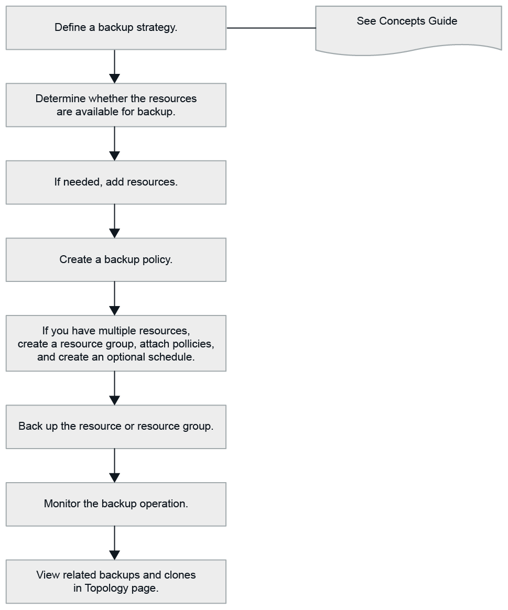

= 備份 IBM Db2 資源
:allow-uri-read: 
:icons: font
:imagesdir: ../media/

[role="lead"]
您可以建立資源（資料庫）或資源組的備份。備份工作流程包括規劃、識別要備份的資料庫、管理備份策略、建立資源群組和附加策略、建立備份以及監控作業。

以下工作流程顯示了執行備份作業必須遵循的順序：

您也可以手動或在腳本中使用 PowerShell cmdlet 來執行備份、還原和複製作業。 SnapCenter cmdlet 說明和 cmdlet 參考資訊包含更多有關 PowerShell cmdlet 的資訊。https://docs.netapp.com/us-en/snapcenter-cmdlets/index.html["SnapCenter軟體 Cmdlet 參考指南"^] 。
