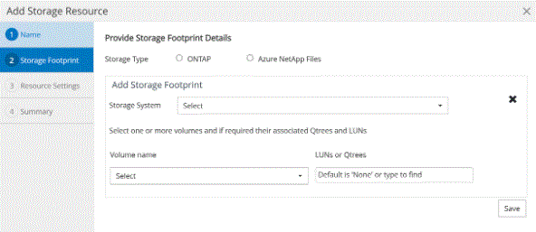

= 為NetApp支援的插件新增資源
:allow-uri-read: 
:icons: font
:imagesdir: ../media/

[role="lead"]
您必須新增想要備份或複製的資源。根據您的環境，資源可能是您想要備份或複製的資料庫執行個體或集合。

.開始之前
* 您必須完成安裝SnapCenter伺服器、新增主機、建立儲存系統連線和新增憑證等任務。
* 您必須已將插件上傳到SnapCenter伺服器。

.步驟
. 在左側導覽窗格中，選擇*資源*，然後從清單中選擇適當的外掛程式。
. 在資源頁面中，選擇*新增資源*。
. 在提供資源詳細資訊頁面中，執行以下操作：
+
|===
| 對於這個領域... | 這樣做... 

 a| 
Name
 a| 
輸入資源的名稱。

 a| 
主機名稱
 a| 
選擇主機。

 a| 
類型
 a| 
選擇類型。類型是用戶根據插件描述文件定義的。例如資料庫和實例。

如果所選類型有父級，請輸入父級的詳細資料。例如，如果類型是資料庫且父級是實例，請輸入實例的詳細資訊。

 a| 
憑證名稱
 a| 
選擇憑證或建立新憑證。

 a| 
安裝路徑
 a| 
輸入資源掛載的掛載路徑。這僅適用於 Windows 主機。

|===
. 在「提供儲存佔用空間」頁面中，選擇儲存系統並選擇一個或多個磁碟區、LUN 和 qtree，然後選擇*儲存*。
+
可選：選擇image:../media/add_policy_from_resourcegroup.gif["加號圖示"]圖示從其他儲存系統新增更多磁碟區、LUN 和 qtree。

+

NOTE: NetApp支援的外掛程式不支援資源的自動發現。實體和虛擬環境的儲存細節也無法自動發現。建立資源時必須提供實體和虛擬環境的儲存資訊。

+

. 在資源設定頁面中，為資源提供自訂鍵值對。
+

NOTE: 確保自訂鍵名稱是大寫的。

+
image::../media/resource_settings.gif[資源設定]

+
有關個別插件參數，請參閱link:add_resources_to_netapp_supported_plugins.html#parameters-to-configure-the-resource["配置資源的參數"]

. 查看摘要，然後選擇*完成*。

.結果
資源與類型、主機或叢集名稱、相關資源群組和策略以及總體狀態等資訊一起顯示。

IMPORTANT: 如果資料庫在SnapCenter之外重新命名，則必須刷新資源。

.完成後
如果您想向其他使用者提供對資產的存取權限， SnapCenter管理員必須將資產指派給這些使用者。這使用戶能夠對分配給他們的資產執行他們有權限執行的操作。

新增資源後，您可以修改資源詳情。如果NetApp支援的外掛程式資源具有與其關聯的備份，則無法修改下列欄位：資源名稱、資源類型和主機名稱。

== 配置資源的參數

如果您手動新增插件，則可以使用下列參數在資源設定頁面中配置資源。

=== MongoDB 插件

資源設定：

* MONGODB_APP_SERVER=（對於資源類型為分片群集）或 MONGODB_REPLICASET_SERVER=（對於資源類型為副本集）
* OPLOG_PATH=（如果從 MongoDB.properties 檔案提供，則為可選參數）
* MONGODB_AUTHENTICATION_TYPE=（LDAP 驗證為 PLAIN，其他驗證為 None）

您必須提供 MongoDB.properties 檔案中需要提供的以下參數：

* 禁用啟動停止服務=
+
** 如果啟動/停止服務由插件執行，則為 N。
** 如果啟動/停止服務由使用者執行，則為 Y。
** 可選參數的預設值設定為 N。

* OPLOG_PATH_=（如果它已經在SnapCenter中作為自訂鍵值對提供，則為可選參數）。

=== MaxDB 插件

資源設定：

* XUSER_ENABLE (Y|N) 啟用或停用 MaxDB 的 xuser 使用，這樣資料庫使用者就不需要密碼了。
* HANDLE_LOGWRITER (Y|N) 執行暫停日誌寫入器 (N) 或復原日誌寫入器 (Y) 操作。
* DBMCLICMD（path_to_dbmcli_cmd）指定 MaxDB dbmcli 指令的路徑。如果未設置，則使用搜尋路徑上的 dbmcli。

NOTE: 對於 Windows 環境，路徑必須在雙引號內（“...”）。

* SQLCLICMD (path_to_sqlcli_cmd) 指定 MaxDB sqlcli 指令的路徑。如果未設定路徑，則在搜尋路徑上使用 sqlcli。
* MAXDB_UPDATE_HIST_LOG (Y|N) 指示 MaxDB 備份程式是否應更新 MaxDB 歷史日誌。
* MAXDB_CHECK_SNAPSHOT_DIR：例如，SID1：directory[,directory...]; [SID2：directoary[,directory...] 檢查 Snap Creator Snapshot 複製操作是否成功並確保建立了快照。
+
這僅適用於 NFS。該目錄必須指向包含 .snapshot 目錄的位置。多個目錄可以包含在以逗號分隔的清單中。

+
在 MaxDB 7.8 及更高版本中，資料庫備份請求在備份歷史記錄中標記為「失敗」。

* MAXDB_BACKUP_TEMPLATES：為每個資料庫指定一個備份範本。
+
該模板必須存在，並且是外部類型的備份模板。若要為 MaxDB 7.8 及更高版本啟用快照集成，您必須具有 MaxDB 後台伺服器功能並且已配置 EXTERNAL 類型的 MaxDB 備份模板。

* MAXDB_BG_SERVER_PREFIX：指定後台伺服器名稱的前綴。
+
如果設定了 MAXDB_BACKUP_TEMPLATES 參數，則也必須設定 MAXDB_BG_SERVER_PREFIX 參數。如果不設定前綴，則使用預設值na_bg_。

=== SAP ASE 插件

資源設定：

* SYBASE_SERVER (data_server_name) 指定 Sybase 資料伺服器名稱（isql 指令上的 -S 選項）。例如，p_test。
* 如果使用「ALL」構造，SYBASE_DATABASES_EXCLUDE（db_name）允許排除資料庫。
+
您可以使用分號分隔的清單指定多個資料庫。例如：pubs2;test_db1。

* SYBASE_USER：user_name 指定可以執行 isql 指令的作業系統使用者。
+
UNIX 必需。如果執行 Snap Creator Agent 啟動和停止命令的使用者（通常是 root 使用者）與執行 isql 命令的使用者不同，則需要此參數。

* SYBASE_TRAN_DUMP db_name:directory_path 讓您能夠在建立快照後執行 Sybase 交易轉儲。例如，pubs2:/sybasedumps/pubs2
+
您必須指定每個需要事務轉儲的資料庫。

* SYBASE_TRAN_DUMP_COMPRESS (Y|N) 啟用或停用本機 Sybase 交易轉儲壓縮。
* SYBASE_ISQL_CMD（例如，/opt/sybase/OCS-15_0/bin/isql）定義 isql 指令的路徑。
* SYBASE_EXCLUDE_TEMPDB (Y|N) 可讓您自動排除使用者建立的臨時資料庫。

=== Oracle 應用程式外掛程式 (ORASCPM)

資源設定：

* SQLPLUS_CMD 指定 SQLplus 的路徑。
* ORACLE_DATABASES 列出了要備份的 Oracle 資料庫和對應的使用者（資料庫：使用者）。
* CNTL_FILE_BACKUP_DIR 指定控制檔備份的目錄。
* ORA_TEMP 指定暫存檔案的目錄。
* ORACLE_HOME 指定 Oracle 軟體的安裝目錄。
* ARCHIVE_LOG_ONLY 指定是否備份存檔日誌。
* ORACLE_BACKUPMODE 指定是否執行線上或離線備份。
* ORACLE_EXPORT_PARAMETERS 指定在執行 _/bin/su <user running sqlplus> -c sqlplus /nolog <cmd>_ 時是否應重新匯出上面定義的環境變數。通常情況下，當執行 sqlplus 的使用者尚未設定使用 _connect / as sysdba_ 連接到資料庫所需的所有環境變數時，就會發生這種情況。

