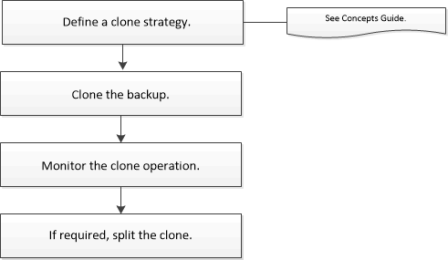

= 克隆工作流程
:allow-uri-read: 
:icons: font
:imagesdir: ../media/

[role="lead"]
克隆工作流程包括執行克隆操作和監視操作。

.關於此任務
* 您可以在來源 PostgreSQL 伺服器上複製。
* 您可能會因為以下原因而複製資源備份：
+
** 在應用程式開發週期中測試必須使用目前資源結構和內容實現的功能
** 用於填充資料倉儲時的資料擷取和操作工具
** 恢復被錯誤刪除或更改的數據

以下工作流程顯示了執行複製操作必須遵循的順序：

您也可以手動或在腳本中使用 PowerShell cmdlet 來執行備份、還原和複製作業。  SnapCenter cmdlet 說明和 cmdlet 參考資訊包含有關 PowerShell cmdlet 的詳細資訊。
