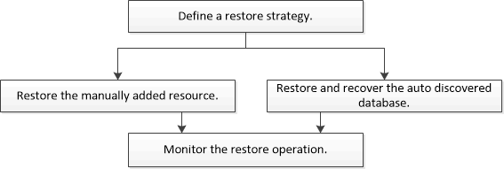

= 復原工作流程
:allow-uri-read: 
:icons: font
:imagesdir: ../media/

[role="lead"]
還原和復原工作流程包括規劃、執行還原操作和監視操作。

以下工作流程顯示了執行還原作業必須遵循的順序：

您也可以手動或在腳本中使用 PowerShell cmdlet 來執行備份、還原和複製作業。  SnapCenter cmdlet 說明和 cmdlet 參考資訊包含有關 PowerShell cmdlet 的詳細資訊。

https://docs.netapp.com/us-en/snapcenter-cmdlets/index.html["SnapCenter軟體 Cmdlet 參考指南"^] 。
