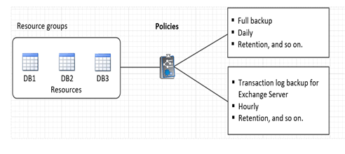

= 做好資料保護準備
:allow-uri-read: 
:icons: font
:imagesdir: ../media/

[role="lead"]
在執行任何資料保護操作（例如備份、複製或復原作業）之前，您必須定義策略並設定環境。您也可以設定SnapCenter伺服器以使用SnapMirror和SnapVault技術。

若要利用SnapVault和SnapMirror技術，您必須在儲存裝置上設定並初始化來源磁碟區和目標磁碟區之間的資料保護關係。您可以使用 NetAppSystem Manager 或儲存控制台命令列來執行這些任務。

*查找更多資訊*

link:https://docs.netapp.com/us-en/ontap-automation/getting_started_with_the_rest_api.html["開始使用 REST API"]

== 使用適用於 Microsoft Exchange Server 的SnapCenter外掛程式的先決條件

在使用 Exchange 外掛程式之前， SnapCenter管理員必須安裝和設定SnapCenter伺服器並執行先決條件任務。

* 安裝並配置SnapCenter伺服器。
* 登入SnapCenter。
* 透過新增或指派儲存系統連線並建立憑證來配置SnapCenter環境。
+

NOTE: SnapCenter不支援不同叢集上具有相同名稱的多個 SVM。  SnapCenter支援的每個 SVM 都必須具有唯一的名稱。

* 新增主機，安裝適用於 Microsoft Windows 的SnapCenter插件和適用於 Microsoft Exchange Server 的SnapCenter插件，並發現（重新整理）資源。
* 使用適用於 Microsoft Windows 的SnapCenter外掛程式執行主機端儲存配置。
* 如果您使用SnapCenter Server 保護駐留在 VMware RDM LUN 上的 Exchange 資料庫，則必須部署SnapCenter Plug-in for VMware vSphere並向SnapCenter註冊外掛程式。  SnapCenter Plug-in for VMware vSphere文件包含更多資訊。
+

NOTE: 不支援 VMDK。

* 使用 Microsoft Exchange 工具將現有的 Microsoft Exchange Server 資料庫從本機磁碟移至支援的儲存體。
* 如果您想要備份複製，請設定SnapMirror和SnapVault關係。

對於SnapCenter 4.1.1 用戶，SnapCenter Plug-in for VMware vSphere包含有關保護虛擬化資料庫和檔案系統的資訊。對於SnapCenter 4.2.x 用戶， NetApp Data Broker 1.0 和 1.0.1 文件包含有關使用基於 Linux 的NetApp Data Broker 虛擬設備（開放虛擬設備格式）提供的適用SnapCenter Plug-in for VMware vSphere保護虛擬化資料庫和檔案系統的資訊。對於SnapCenter 4.3.x 用戶，SnapCenter Plug-in for VMware vSphere文件包含有關使用基於 Linux 的SnapCenter Plug-in for VMware vSphere保護虛擬化資料庫和檔案系統的資訊。

https://docs.netapp.com/us-en/sc-plugin-vmware-vsphere/["SnapCenter Plug-in for VMware vSphere文檔"^]

== 如何使用資源、資源群組和原則來保護 Exchange Server

在使用SnapCenter之前，了解與要執行的備份、還原和重新播種作業相關的基本概念會很有幫助。您與資源、資源群組和策略進行互動以執行不同的操作。

* 資源通常是使用SnapCenter備份的郵件資料庫或 Microsoft Exchange 資料庫可用性群組 (DAG)。
* SnapCenter資源組是主機或 Exchange DAG 上的資源集合，資源組可以包含整個 DAG 或單一資料庫。
+
當您對資源組執行操作時，您將根據為資源組指定的計劃對資源組中定義的資源執行該操作。

+
您可以按需備份單一資源或資源群組。您也可以對單一資源和資源群組執行排程備份。

+
資源組以前稱為資料集。

* 這些策略指定了備份頻率、副本保留、腳本以及資料保護作業的其他特徵。
+
建立資源組時，您可以為該組選擇一個或多個策略。您也可以在對單一資源執行按需備份時選擇一個或多個策略。

可以將資源群組視為定義您想要保護的內容以及您想要在日期和時間方面保護的內容。把政策看作是定義你想如何保護它。例如，如果要備份主機的所有資料庫，則可以建立包含主機中所有資料庫的資源群組。然後，您可以將兩個策略附加到資源群組：每日策略和每小時策略。建立資源組並附加策略時，您可以設定資源組以每天執行一次完整備份，並配置另一個每小時執行一次日誌備份的計畫。下圖說明了資料庫的資源、資源群組和策略之間的關係：

