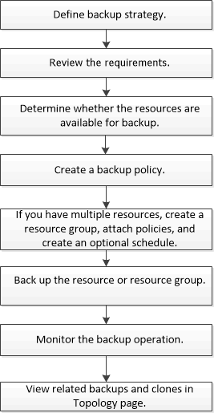

= 備份過程概述
:allow-uri-read: 
:icons: font
:imagesdir: ../media/

[role="lead"]
您可以建立資源（資料庫）或資源組的備份。備份過程包括規劃、確定備份資源、建立備份策略、建立資源群組和附加策略、建立備份以及監控作業。

以下工作流程顯示了執行備份作業必須遵循的順序：

在為 Oracle 資料庫建立備份時，會在 Oracle 資料庫主機的 _/var/opt/snapcenter/sco/lock_ 目錄中建立一個操作鎖定檔案 (_.sm_lock_dbsid_)，以避免在資料庫上執行多個操作。資料庫備份完成後，操作鎖定檔案將自動刪除。

但是，如果上一次備份完成時出現警告，則操作鎖定檔案可能不會被刪除，並且下一個備份作業將進入等待佇列。如果不刪除 *.sm_lock_dbsid* 文件，它最終可能會被取消。在這種情況下，您必須透過執行下列步驟手動刪除操作鎖定檔案：

. 從命令提示字元處，導覽至 _/var/opt/snapcenter/sco/lock_。
. 刪除操作鎖：``rm -rf .sm_lock_dbsid.``

