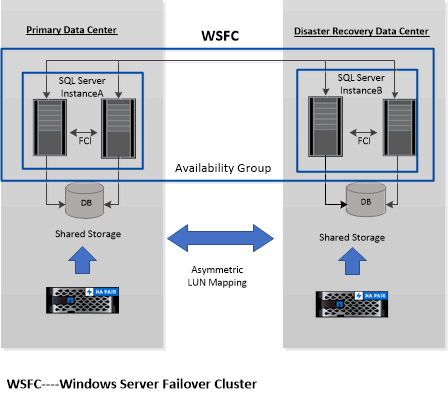

= 支援 Windows 群集中的非對稱 LUN 映射
:allow-uri-read: 
:icons: font
:imagesdir: ../media/

[role="lead"]
適用於 Microsoft SQL Server 的SnapCenter外掛程式支援 SQL Server 2012 及更高版本中的發現、用於高可用性的非對稱 LUN 對應 (ALM) 配置以及用於災難復原的可用性群組。在發現資源時， SnapCenter會在 ALM 設定中發現本機主機和遠端主機上的資料庫。

ALM 配置是單一 Windows 伺服器故障轉移群集，其中包含主資料中心中的一個或多個節點以及災難復原中心中的一個或多個節點。

以下是 ALM 配置的範例：

* 多站點資料中心中的兩個故障轉移群集實例 (FCI)
* FCI 用於本地高可用性 (HA) 和可用性群組 (AG)，用於在災難復原站點使用獨立實例進行災難復原

主資料中心中的儲存空間在主資料中心中的 FCI 節點之間共用。災難復原資料中心中的儲存空間在災難復原資料中心中的 FCI 節點之間共用。

主資料中心上的儲存空間對於災難復原資料中心上的節點是不可見的，反之亦然。

ALM 架構結合了 FCI 使用的兩種共用儲存解決方案以及 SQL AG 使用的非共用或專用儲存解決方案。 AG 解決方案使用相同的磁碟機號碼來跨資料中心共用磁碟資源。這種儲存安排，即叢集磁碟在 WSFC 內的節點子集之間共用，稱為 ALM。
