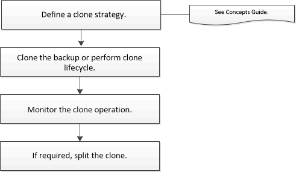

= 克隆工作流程
:allow-uri-read: 
:icons: font
:imagesdir: ../media/

[role="lead"]
在從備份複製資料庫資源之前，您必須使用SnapCenter Server 執行幾項任務。資料庫克隆是建立生產資料庫或其備份集的時間點副本的過程。您可以複製資料庫來測試在應用程式開發週期中必須使用目前資料庫結構和內容實現的功能，在填充資料倉儲時使用資料擷取和操作工具，或還原被錯誤刪除或變更的資料。

資料庫克隆操作根據作業 ID 產生報告。

以下工作流程顯示了執行複製操作的順序：

您也可以手動或在腳本中使用 PowerShell cmdlet 來執行備份、還原、還原、驗證和複製作業。有關 PowerShell cmdlet 的詳細信息，請使用SnapCenter cmdlet 協助或參閱 https://docs.netapp.com/us-en/snapcenter-cmdlets/index.html["SnapCenter軟體 Cmdlet 參考指南"]

*查找更多資訊*

link:task_clone_from_a_sql_server_database_backup.html["從 SQL Server 資料庫備份克隆"]

link:task_perform_clone_lifecycle_management.html["執行複製生命週期"]

link:https://kb.netapp.com/Advice_and_Troubleshooting/Data_Protection_and_Security/SnapCenter/Clone_operation_might_fail_or_take_longer_time_to_complete_with_default_TCP_TIMEOUT_value["克隆操作可能失敗或需要更長時間才能完成，且使用預設 TCP_TIMEOUT 值"]
