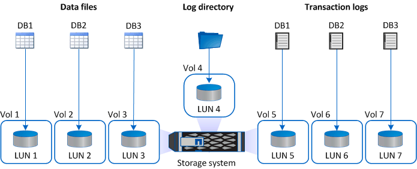
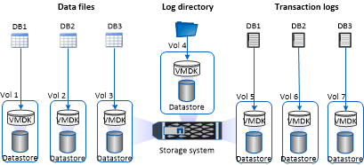

= 適用於 Microsoft SQL Server 的SnapCenter外掛程式的儲存佈局建議
:allow-uri-read: 
:icons: font
:imagesdir: ../media/

[role="lead"]
精心設計的儲存佈局可讓SnapCenter Server 備份您的資料庫以滿足您的復原目標。在定義儲存佈局時，您應該考慮幾個因素，包括資料庫的大小、資料庫的變化率以及執行備份的頻率。

以下部分定義了在您的環境中安裝了適用於 Microsoft SQL Server 的SnapCenter插件的 LUN 和虛擬機器磁碟 (VMDK) 的儲存佈局建議和限制。

在這種情況下，LUN 可以包括映射到來賓的 VMware RDM 磁碟和 iSCSI 直連 LUN。

== LUN 和 VMDK 要求

您可以選擇使用專用 LUN 或 VMDK 來實現以下資料庫的最佳效能和管理：

* 主系統資料庫和模型系統資料庫
* 臨時資料庫
* 使用者資料庫檔案（.mdf 和 .ndf）
* 使用者資料庫事務日誌檔（.ldf）
* 日誌目錄

要恢復大型資料庫，最佳做法是使用專用 LUN 或 VMDK。恢復完整的 LUN 或 VMDK 所需的時間少於恢復儲存在 LUN 或 VMDK 中的單一檔案所需的時間。

對於日誌目錄，您應該建立一個單獨的 LUN 或 VMDK，以便在資料或日誌檔案磁碟中有足夠的可用空間。

== LUN 和 VMDK 範例佈局

下圖顯示如何在 LUN 上設定大型資料庫的儲存佈局：

下圖顯示如何在 LUN 上配置中型或小型資料庫的儲存佈局：

image::../media/smsql_storage_layout_mult_dbs_luns_snapcenter.gif[每個 LUN 多個資料庫圖表]

下圖顯示如何在 VMDK 上配置大型資料庫的儲存佈局：

下圖顯示如何在 VMDK 上配置中型或小型資料庫的儲存佈局：

image::../media/smsql_storage_layout_med_small_dbs_vmdk.gif[VMDK 上中型或小型資料庫的儲存佈局]
