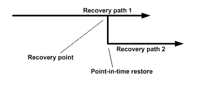

= 恢復操作的類型
:allow-uri-read: 
:icons: font
:imagesdir: ../media/

[role="lead"]
您可以使用SnapCenter對 SQL Server 資源執行不同類型的還原作業。

* 恢復最新狀態
* 恢復到之前的時間點

在以下情況下，您可以恢復到最新時間點或恢復到先前的時間點：

* 從SnapMirror或SnapVault二級儲存恢復
* 恢復到備用路徑（位置）

NOTE: SnapCenter不支援基於磁碟區的SnapRestore。

== 恢復最新狀態

在最新的復原操作（預設選擇）中，資料庫將恢復到故障點。  SnapCenter透過執行以下序列來實現此目的：

. 在還原資料庫之前備份最後一個活動交易日誌。
. 從您選擇的完整資料庫備份還原資料庫。
. 套用所有未提交到資料庫的交易日誌（包括從備份建立時到目前時間的備份交易日誌）。
+
交易日誌被向前移動並應用於任何選定的資料庫。

最新的復原操作需要一組連續的交易日誌。

由於SnapCenter無法從日誌傳送備份檔案還原 SQL Server 資料庫交易日誌（日誌傳送可讓您自動將交易日誌備份從主伺服器執行個體上的主資料庫傳送至單獨的輔助伺服器執行個體上的一個或多個輔助資料庫），因此您無法從交易日誌備份執行最新的還原作業。因此，您應該使用SnapCenter來備份 SQL Server 資料庫交易記錄檔。

如果您不需要為所有備份保留最新的還原功能，則可以透過備份原則設定係統的交易日誌備份保留。

== 最新恢復操作的範例

假設您每天中午執行 SQL Server 備份，並且星期三下午 4:00 需要從備份中還原。由於某種原因，週三中午的備份未能驗證，因此您決定從週二中午的備份進行還原。此後，如果還原了備份，則所有交易日誌都會向前移動並應用於還原的資料庫，從建立星期二備份時未提交的交易日誌開始，一直到星期三下午 4:00 寫入的最新交易日誌（如果交易日誌已備份）。

== 恢復到之前的時間點

在時間點還原作業中，資料庫僅還原到過去的特定時間。時間點還原操作發生在下列還原情況：

* 資料庫還原到備份交易日誌中的給定時間。
* 資料庫已恢復，並且僅將備份交易日誌的子集套用至該資料庫。

NOTE: 將資料庫還原到某個時間點會產生新的復原路徑。

下圖說明了執行時間點還原作業時出現的問題：

在影像中，復原路徑 1 由完整備份和隨後的幾個交易日誌備份組成。您將資料庫還原到某個時間點。時間點還原作業後會建立新的交易日誌備份，產生復原路徑 2。新的交易日誌備份是在沒有建立新的完整備份的情況下建立的。由於資料損壞或其他問題，您無法還原目前資料庫，直到建立新的完整備份。此外，無法將在復原路徑 2 中建立的交易日誌套用至屬於復原路徑 1 的完整備份。

如果您套用交易日誌備份，您也可以指定停止套用備份交易的特定日期和時間。為此，您需要指定可用範圍內的日期和時間， SnapCenter將刪除該時間點之前未提交的任何交易。您可以使用此方法將資料庫還原到發生損壞之前的時間點，或從意外的資料庫或資料表刪除中復原。

== 時間點還原操作範例

假設您在午夜進行一次完整資料庫備份，並每小時進行一次交易日誌備份。資料庫在上午 9:45 崩潰，但您仍然備份了故障資料庫的交易日誌。您可以從以下時間點還原場景中進行選擇：

* 恢復午夜所做的完整資料庫備份，並接受隨後所做的資料庫變更的遺失。  （選項：無）
* 還原完整的資料庫備份並套用所有交易日誌備份直到上午 9:45（選項：記錄到）
* 還原完整的資料庫備份並套用交易日誌備份，指定您希望交易從最後一組交易日誌備份還原的時間。  （選項：按具體時間）

在這種情況下，您需要計算報告某個錯誤的日期和時間。任何未在指定日期和時間之前提交的事務都將被刪除。
