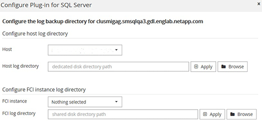

= 新增主機並安裝適用於 Windows 的SnapCenter插件包
:allow-uri-read: 
:icons: font
:imagesdir: ../media/

[role="lead"]
您必須使用SnapCenter *新增主機*頁面來新增主機並安裝插件包。插件會自動安裝在遠端主機上。

.開始之前
* 如果SnapCenter Server 主機的作業系統是 Windows 2019，而插件主機的作業系統是 Windows 2022，則應執行下列操作：
+
** 升級到 Windows Server 2019（作業系統內部版本 17763.5936）或更高版本
** 升級到 Windows Server 2022（作業系統內部版本 20348.2402）或更高版本

* 您必須是分配有插件安裝和卸載權限的角色的用戶，例如SnapCenter管理員角色。
* 在 Windows 主機上安裝外掛程式時，如果指定非內建的憑證，則應在主機上停用 UAC。
* 您應該確保訊息佇列服務處於運行狀態。
* 如果您使用群組託管服務帳戶 (gMSA)，則應使用管理權限設定 gMSA。
+
link:task_configure_gMSA_on_windows_server_2012_or_later.html["在 Windows Server 2016 或更高版本上為 SQL 設定組託管服務帳戶"^]

.關於此任務
您不能將SnapCenter伺服器作為插件主機新增至另一個SnapCenter伺服器。

您可以新增主機並為單一主機或叢集安裝插件包。如果您在叢集或 Windows Server 故障轉移叢集 (WSFC) 上安裝插件，則插件將安裝在叢集的所有節點上。

有關管理主機的信息，請參閱link:../admin/concept_manage_hosts.html["管理主機"^]。

.步驟
. 在左側導覽窗格中，選擇*主機*。
. 驗證頂部的「*託管主機*」標籤是否已選取。
. 選擇“*新增*”。
. 在「主機」頁面中執行以下操作：
+
|===
| 對於這個領域... | 這樣做... 

 a| 
主機類型
 a| 
選擇 Windows 作為主機類型。  SnapCenter伺服器會新增主機，然後安裝適用於 Windows 的插件（如果主機上尚未安裝該插件）。

如果您在「外掛程式」頁面上選擇「Microsoft SQL Server」選項， SnapCenter伺服器將安裝 SQL Server 外掛程式。

 a| 
主機名稱
 a| 
輸入主機的完全限定網域名稱 (FQDN) 或 IP 位址。只有當 IP 位址解析為 FQDN 時，不受信任的網域主機才支援該 IP 位址。

SnapCenter依賴 DNS 的正確配置。因此，最佳做法是輸入 FQDN。

您可以輸入以下之一的 IP 位址或 FQDN：

** 獨立主機
** WSFC 如果您使用SnapCenter新增主機且該主機是子網域的一部分，則必須提供 FQDN。

 a| 
證書
 a| 
選擇您建立的憑證名稱或建立新的憑證。該憑證必須具有遠端主機的管理權限。有關詳細信息，請參閱有關建立憑證的資訊。

您可以將遊標置於指定的憑證名稱上來查看有關憑證的詳細資訊。

NOTE: 憑證驗證模式由您在新增主機精靈中指定的主機類型決定。

|===
. 在*選擇要安裝的插件*部分中，選擇要安裝的插件。
. 選擇*更多選項*。
+
|===
| 對於這個領域... | 這樣做... 

 a| 
港口
 a| 
保留預設連接埠號碼或指定連接埠號碼。預設連接埠號碼為 8145。如果SnapCenter伺服器安裝在自訂連接埠上，則該連接埠號碼將顯示為預設連接埠。

NOTE: 如果您手動安裝了插件並指定了自訂端口，則必須指定相同的端口。否則，操作失敗。

 a| 
安裝路徑
 a| 
預設路徑為 C:\Program Files\ NetApp\ SnapCenter。您可以選擇自訂路徑。

 a| 
新增叢集中的所有主機
 a| 
選取此核取方塊可新增 WSFC 或 SQL 可用性群組中的所有叢集節點。如果您想要管理和識別叢集內的多個可用的 SQL 可用性群組，則應該透過選擇 GUI 中的對應叢集複選框來新增所有叢集節點。

 a| 
跳過預安裝檢查
 a| 
如果您已經手動安裝了插件並且不想驗證主機是否符合安裝插件的要求，請選取此核取方塊。

 a| 
使用群組託管服務帳戶 (gMSA) 執行外掛程式服務
 a| 
如果要使用群組託管服務帳戶 (gMSA) 來執行外掛程式服務，請選取此核取方塊。

以以下格式提供 gMSA 名稱：domainName\accountName$。

NOTE: 如果主機新增了 gMSA，且 gMSA 具有登入和系統管理員權限，則 gMSA 將用於連線到 SQL 實例。

|===
. 選擇*提交*。
. 對於SQL插件，選擇主機來設定日誌目錄。
+
.. 選擇*設定日誌目錄*，在設定主機日誌目錄頁面中選擇*瀏覽*並完成下列步驟：
+
僅列出NetApp LUN（驅動器）可供選擇。  SnapCenter在備份作業過程中備份並複製主機日誌目錄。

+

+
... 選擇主機上將儲存主機日誌的磁碟機號碼或掛載點。
... 如果需要，請選擇一個子目錄。
... 選擇*儲存*。

. 選擇*提交*。
+
如果您未選取「跳過預先檢查」複選框，則會驗證主機是否符合安裝插件的要求。系統會根據最低要求驗證磁碟空間、RAM、PowerShell 版本、.NET 版本、位置（適用於 Windows 外掛程式）和 Java 版本（適用於 Linux 外掛程式）。如果不符合最低要求，則會顯示相應的錯誤或警告訊息。

+
如果錯誤與磁碟空間或 RAM 有關，您可以更新位於 C:\Program Files\ NetApp\ SnapCenter WebApp 的 web.config 檔案以修改預設值。如果錯誤與其他參數有關，則必須修復該問題。

+

NOTE: 在 HA 設定中，如果您要更新 web.config 文件，則必須在兩個節點上更新該文件。

. 監控安裝進度。

