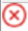

= 在拓樸頁面中檢視 SQL Server 備份和克隆
:allow-uri-read: 
:icons: font
:imagesdir: ../media/

[role="lead"]
當您準備備份或複製資源時，您可能會發現查看主儲存和輔助儲存上所有備份和複製的圖形表示很有幫助。

.關於此任務
在拓樸頁面中，您可以看到所選資源或資源組可用的所有備份和複製。您可以查看這些備份和克隆的詳細信息，然後選擇它們來執行資料保護操作。

您可以查看「管理副本」檢視中的以下圖標，以確定備份和複製是否在主儲存或輔助儲存（鏡像副本或保險庫副本）上可用。

* 顯示主儲存體上可用的備份和克隆的數量。
* image:../media/topology_mirror_secondary_storage.gif["二級儲存鏡像圖標"]顯示使用SnapMirror技術在二級儲存上鏡像的備份和克隆的數量。
* 顯示使用SnapVault技術在二級儲存上複製的備份和克隆的數量。
+
** 顯示的備份數量包括從輔助儲存中刪除的備份。
+
例如，如果您使用僅保留 4 個備份的策略建立了 6 個備份，則顯示的備份數為 6。

NOTE: 鏡像保管庫類型磁碟區上的版本靈活鏡像的備份的複製顯示在拓撲視圖中，但拓撲視圖中的鏡像備份計數不包括版本靈活備份。

如果您具有作為SnapMirror主動同步的輔助關係（最初是作為SnapMirror業務連續性 [SM-BC] 發布），您可以看到以下附加圖示：

* 副本網站已啟動。
* 副本網站已關閉。
* image:../media/topology_reestablished.png["關係重建"]輔助鏡像或保險庫關係尚未重新建立。

.步驟
. 在左側導覽窗格中，按一下“*資源*”，然後從清單中選擇適當的外掛程式。
. 在資源頁面中，從*檢視*下拉清單中選擇資源或資源群組。
. 從資源詳細資料檢視或資源群組詳細資料檢視中選擇資源。
+
如果選擇的資源是克隆的資料庫，則保護克隆的資料庫，克隆的來源顯示在拓撲頁面中。按一下「*詳細資料*」以查看用於複製的備份。

+
如果資源受到保護，則會顯示所選資源的拓樸頁面。

. 查看摘要卡以了解主儲存和輔助儲存上可用的備份和複製數量的摘要。
+
*摘要卡*部分顯示備份和克隆的總數。

+
點擊“*刷新*”按鈕開始查詢儲存以顯示準確的計數。

+
如果進行了啟用SnapLock的備份，則按一下「刷新」按鈕將刷新從ONTAP檢索到的主 SnapLock 和輔助SnapLock到期時間。每週計劃還會刷新從ONTAP檢索到的主 SnapLock 和輔助SnapLock到期時間。

+
當應用程式資源分佈在多個磁碟區上時，備份的SnapLock到期時間將是磁碟區中快照設定的最長SnapLock到期時間。從ONTAP中檢索最長的SnapLock到期時間。

+
對於SnapMirror活動同步，按一下「*刷新*」按鈕可透過查詢主網站和副本網站的ONTAP來刷新SnapCenter備份清單。每週計劃也會針對包含SnapMirror活動同步關係的所有資料庫執行此活動。

+
** 對於SnapMirror主動同步且僅適用於ONTAP 9.14.1，應在故障轉移後手動配置與新主目標的非同步鏡像或非同步 MirrorVault 關係。從ONTAP 9.15.1 開始，非同步鏡像或非同步 MirrorVault 會自動配置為新的主目標。
** 故障轉移後，應為SnapCenter建立備份以了解故障轉移。只有在建立備份後，您才可以點選「*刷新*」。

. 在「管理副本」檢視中，按一下主儲存或輔助儲存中的「備份」或「複製」以查看備份或複製的詳細資訊。
+
備份和克隆的詳細資訊以表格形式顯示。

. 從表中選擇備份，然後按一下資料保護圖示執行復原、複製、重新命名和刪除操作。
+

NOTE: 您無法重新命名或刪除輔助儲存體上的備份。

. 從表中選擇一個克隆，然後按一下「克隆拆分」。
. 如果要刪除克隆，請從表中選擇克隆，然後按一下image:../media/delete_icon.gif["刪除圖示"]。

