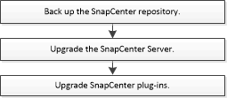

= 升級工作流程
:allow-uri-read: 
:icons: font
:imagesdir: ../media/

[role="lead"]
SnapCenter的每個版本都包含更新的SnapCenter伺服器和插件包。插件包更新隨SnapCenter安裝程式一起分發。您可以設定SnapCenter來檢查可用的更新。

工作流程顯示了升級SnapCenter伺服器和插件包所需的不同任務。

== 支援的升級路徑

升級路徑可協助您了解可以從哪些早期版本的SnapCenter升級至最新版本的SnapCenter以及支援哪些版本的外掛程式。

|===
| 如果您使用的是SnapCenter Server 版本... | 您可以直接將SnapCenter Server 升級到... | 支援的插件版本 

.3+| 5.0 | 6.0  a| 
* 5.0
* 6.0

| 6.0.1  a| 
* 6.0.1

| 6.1  a| 
* 6.1

.2+| 6.0  a| 
6.0.1
 a| 
* 6.0
* 6.0.1

| 6.1  a| 
* 6.1

| 6.0.1 | 6.1  a| 
* 6.0.1
* 6.1

|===
有關升級適用SnapCenter Plug-in for VMware vSphere的信息，請參閱 https://docs.netapp.com/us-en/sc-plugin-vmware-vsphere/scpivs44_upgrade.html["升級SnapCenter Plug-in for VMware vSphere"^]。
